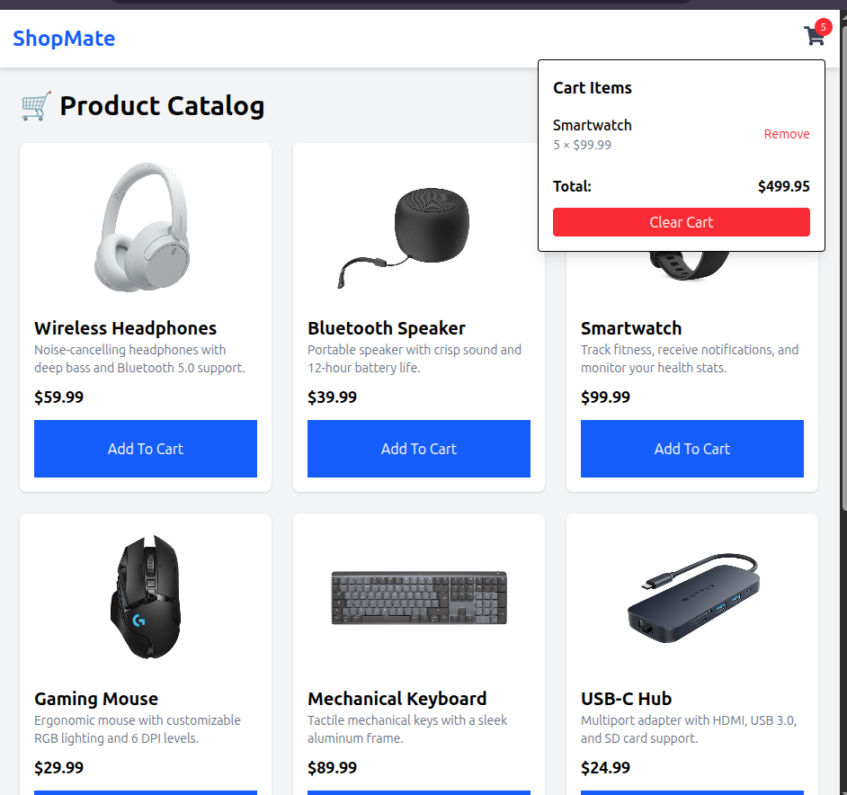

Perfect 👌🏽! Since this is your **shopping cart app (shoppingcart)** built with **React, Vite, TailwindCSS, and JSON Server**, I’ll draft a README.md tailored for it. You can just drop this in your root folder.

---

# 🛒 ShoppingCart App



A simple shopping cart web app built with **React + Vite** for the frontend and **JSON Server** as a mock backend. The app allows users to browse products, add them to the cart, and manage their shopping experience.

## ✨ Features

* 📦 Browse and view products
* 🛍️ Add / remove items from the cart
* 🔄 Update item quantities
* 💸 See total cost in real time
* ⚡ Fast development with **Vite**
* 🎨 Styled with **TailwindCSS**

## 🛠️ Tech Stack

* **Frontend**: React, Vite, TailwindCSS, React Icons
* **Backend**: JSON Server (for mock API)
* **Tooling**: ESLint for linting

## 🚀 Installation & Setup

Clone the repository:

```bash
git clone https://github.com/your-username/shoppingcart.git
cd shoppingcart
```

Install dependencies:

```bash
npm install
```

Run the development server:

```bash
npm run dev
```

Run the mock backend (JSON Server):

```bash
npm run json-server
```

> By default, JSON Server runs on **[http://localhost:8000](http://localhost:8000)**

## 📂 Folder Structure

```
shoppingcart/
│── public/             # static assets
│── src/
│   ├── components/     # reusable components
│   ├── data/           # db.json for mock API
│   ├── pages/          # app pages
│   ├── App.jsx         # root component
│   ├── main.jsx        # entry point
│── package.json
│── tailwind.config.js
│── vite.config.js
│── README.md
```

## 📖 Usage

1. Start **JSON Server** → products will be served from `src/data/db.json`.
2. Start **Vite Dev Server** → app runs on `http://localhost:5173`.
3. Add products to cart, update quantities, and see total cost update dynamically.

## 🤝 Contributing

Feel free to fork this repo, open issues, or submit pull requests.

## 📜 License

This project is licensed under the MIT License.

---
